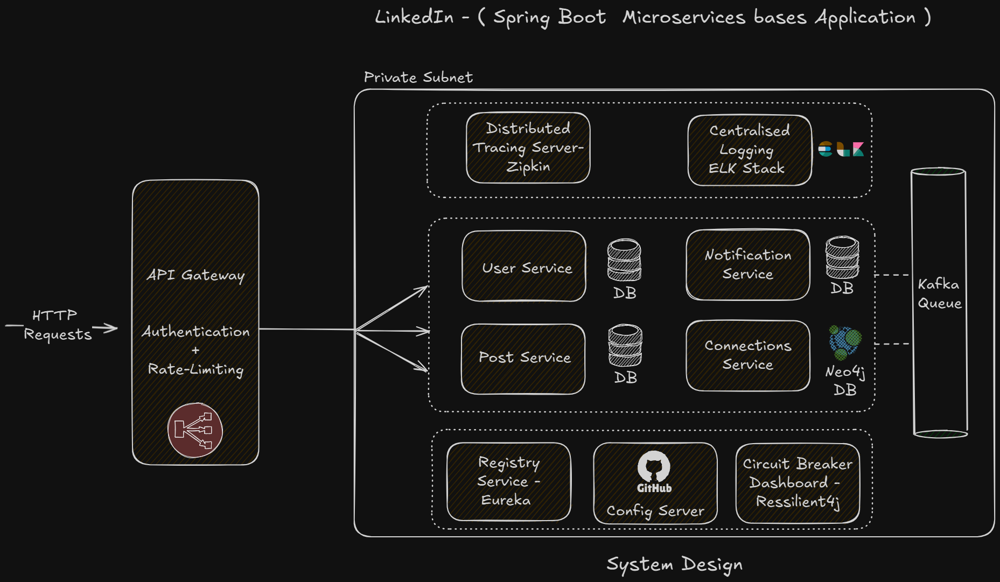

# LinkedIn Spring Boot Application

A **microservice-based LinkedIn-like application** built with **Spring Boot**, **Spring Cloud**, **Docker**, and **Kubernetes**.  
This project demonstrates **scalable service design** with core features such as **User Management**, **Post Creation**, **Feed Generation**, and **Recommendation Engine**.  

---

## 🚀 Features
- **User Service** → Manage user profiles and connections.  
- **Post Service** → Create, update, and fetch posts.  
- **Feed Service** → Personalized feed aggregation.  
- **Recommendation Service** → Suggest people you may know using graph-based algorithms (Neo4j).  
- **Notification Service** → Asynchronous notifications powered by Kafka.  
- **API Gateway** → Centralized routing, authentication, and rate-limiting.  
- **Registry & Config Server** → Service discovery (Eureka) and centralized configuration (Spring Cloud Config).  
- **Circuit Breaker** → Resilience and fault tolerance using Resilience4j.  
- **Distributed Tracing** → End-to-end tracing with Zipkin.  
- **Centralized Logging** → ELK Stack (Elasticsearch, Logstash, Kibana).  

---

## 🏗️ Architecture
The application follows **microservices architecture** where each service is independently deployable and horizontally scalable.  

  

**Key Components:**
- **API Gateway** (Spring Cloud Gateway) → Authentication + Rate Limiting.  
- **Service Discovery** (Eureka) → Dynamic service registration and discovery.  
- **Config Server** → Externalized configuration via GitHub.  
- **Microservices** (User, Post, Notification, Connections).  
- **Databases**:
  - Relational DB for User, Post, and Notifications.  
  - Neo4j for Connections graph.  
- **Messaging** → Kafka for event-driven communication.  
- **Observability** → Zipkin + ELK stack.  
- **Resilience** → Circuit breaker dashboard with Resilience4j.  

---

## 🛠️ Tech Stack
- **Backend Framework:** Spring Boot, Spring Cloud  
- **Service Registry:** Netflix Eureka  
- **API Gateway:** Spring Cloud Gateway  
- **Config Management:** Spring Cloud Config (backed by GitHub)  
- **Databases:** MySQL/Postgres, Neo4j  
- **Messaging Queue:** Apache Kafka  
- **Resilience:** Resilience4j  
- **Tracing & Logging:** Zipkin, ELK Stack  
- **Containerization:** Docker  
- **Orchestration:** Kubernetes  

---
## 📂 Project Structure
```
linkedin-springboot-application/
│── user-service/ # Manage users and profiles
│── post-service/ # Post creation and retrieval
│── feed-service/ # Aggregated user feeds
│── recommendation-service/ # Graph-based connection recommendations
│── notification-service/ # Notifications using Kafka
│── api-gateway/ # Centralized gateway
│── registry-service/ # Eureka service registry
│── config-server/ # Centralized config management
│── assets/ # Architecture diagrams, docs
│── docker/ # Dockerfiles for services
│── k8s/ # Kubernetes manifests (deployment, services, ingress)
```
---

## ⚙️ Getting Started

### 1️⃣ Clone the Repository
```bash
git clone https://github.com/AyushPoojariUCD/linkedin-springboot-application.git
cd linkedin-springboot-application
```

### 2️⃣ Build & Run with Docker
```bash
docker-compose up --build
```

### 3️⃣ Deploy to Kubernetes
```bash
kubectl apply -f k8s/
```

### 🔍 Example Use Cases
```
Register User → /api/users/register

Create Post → /api/posts/create

Get Feed → /api/feed/{userId}

Get Recommendations → /api/recommendations/{userId}
```

### 📊 Monitoring & Observability
```

Zipkin UI → http://localhost:9411

Kibana Dashboard → http://localhost:5601

Resilience4j Dashboard → http://localhost:8080/resilience4j
```
